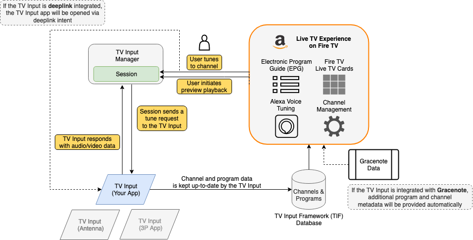

## Overview
Here you will find a sample implementation of integrating live linear content provided by your app with Amazon Fire TV. Find the full docs on Amazon's developer portal - https://developer.amazon.com/docs/fire-tv/introduction-linear-tv-integration.html.

This Sample TV App builds upon [Google's Sample TV input](https://github.com/googlesamples/androidtv-sample-inputs).

## Live TV integration on Fire-TV
If your application provides live content, you can surface it in the Fire TV's Channel Guide and the "On Now" row on Fire TV's home screen as well as make it searchable. The process for integrating live content into the Fire TV browse and search experience follows the same steps as outlined in the standard Android documentation. You need to create a TvInputService and provide channel information for Fire TV to consume. Optionally, you can implement a few shortcuts and alternative options in your app. For example, you can rely on Amazon services to surface programming metadata, and playback can be handled within your application and launched through deeplinks instead of being embedded within the Live TV player native to all Fire TV devices.

## Fire TV supports the following Live TV features:
- Linear channel tiles appear in Fire TV home and live tab for customers entitled to your content
- Channels appear in Fire TV's channel guide woth 14 days of programming
- Playback integrated in Fire TV UI
- Channel tiles can deeplink directly into your app
- Search for station and programming information for next 14 days
- Alexa support for utterances such as “Tune to [channel_name]” and "Tune to channel [channel_number]"
- Ability to favorite channels from browse and search experiences
- Option to provide deep link to playback

**Note:** to see these features in action, clone this repository then build with Android Studio and install the app on your Fire TV device.

## Implementation Flow

## Quick Links
- [RichTvInputService](AndroidTvSampleInput/app/src/main/java/com/example/android/sampletvinput/rich/RichTvInputService.java) - Implementation of Android TV TvInputService. This builds on the base class [BaseTvInputService](AndroidTvSampleInput/library/src/main/java/com/google/android/media/tv/companionlibrary/BaseTvInputService.java). This includes the integration with [playback](AndroidTvSampleInput/app/src/main/java/com/example/android/sampletvinput/rich/RichTvInputService.java#L228) in the Fire TV UI.
- [EpgJobSyncService](AndroidTvSampleInput/library/src/main/java/com/google/android/media/tv/companionlibrary/EpgSyncJobService.java) - This is an abstract class with the majority of an implementation of Android's JobService to be used with the Job Scheduler. Abstract methods GetChannels() and GetProgramsForChannel() are implemented in the [SampleJobService](AndroidTvSampleInput/app/src/main/java/com/example/android/sampletvinput/SampleJobService.java). This holds the core logic of maintaining up to date channel and program metadata in the TIF database.
- [TvContractUtils](AndroidTvSampleInput/library/src/main/java/com/google/android/media/tv/companionlibrary/utils/TvContractUtils.java) - Utility class demonstrating insertion and retrieval of program and channel data in the Tv Input Framework (TIF) database.
- [DemoPlayer](AndroidTvSampleInput/app/src/main/java/com/example/android/sampletvinput/player/DemoPlayer.java) - Example of integration with ExoPlayer to support playback in Fire TV UI (in coordination with the RichTvInputService) as well as in app playback.
- [DemoPlayerActivity](AndroidTvSampleInput/app/src/main/java/com/example/android/sampletvinput/DemoPlayerActivity.java) - Example of handling the deeplink intent URI to support playback in-app when requested by the user from the Fire TV UI.

## Fire TV Metadata Fields
### Channel Fields currently supported by Fire TV
These are the fields supported by Fire TV UI for channel metadata.
- `displayName` - The display name for the channel
- `displayNumber` - Optional field to display a number for the channel. This field supports the Alexa tune to channel number feature
- `inputId` - The Input ID of your TvInputService
- `browsable` - Boolean value to determine if the channel should be browseable
-  `searchable` - Boolean value to determine if the channel should appear in search results
- `internalProviderData` - This field supports a JSON blob with specific keys used by Fire TV
    - `playbackDeepLinkUri` - Field to support a URI to invoke when a customer selects the channel from Fire TV's UI
    - `externalIdType` - Specifies the external metadata service type to provide channel and program metadata through Fire TV services. Talk to your Amazon contact to learn more
    - `externalIdValue` - The ID value for the external metadata provider

### Program Fields currently supported by Fire TV
These are the fields currently supported in the Fire TV UI for Program objects if you are not using any external metadata source.
- `title` - the title for the program
- `startTimeUtcMillis` - the start time of the program, in format of millisecond in UTC time
- `endTimeUtcMillis` - the end time of the program, in format of millisecond in UTC time
- `contentRating` - the standard tv content rating. Ex: TV-PG
- `episodeTitle` - the title of the specific episode of the playing program
- `shortDesciption` - the short description of the program
- `longDescription` - the long description of the program. If this field is provided, it will override the "shortDescription" above.
- `thumbnailUri` - Small image for the program
- `posterArtUri` - Poster art image for the program

### Note on Program and Channel Models

This repository contains implementations of the Program object which represents data pushed to the TIF programs table as well as the Channel object which represents data pushed to the TIF channels table. Additionally the repository implements an InternalProviderData object to represent data stored in the InternalProviderData column on the programs and channels tables.

You may utilize these implementations within your own app or use Android library implementations. Android provides these models in two places:

`com.google.android.libraries.tv:companionlibrary:0.4.1`
and the AndroidX library
`androidx.tvprovider:tvprovider:1.0.0`. The models in these libaries are equivalent to the implementations in this repository with the exception of accepting the InternalProviderData object. Instead those models will take the serialized blob instead.

## Questions, Support, and Feedback
If you have further questions, support or feedback needs please reach out to your Amazon contact who will be able to further assist you. If you have general feedback for the code examples here, feel free to raise a GitHub issue in this repository.

## License
License under the Apache 2.0 license. See the LICENSE file for details.

## Version
Version 1.0

## Notice
Images/videos used in this sample are courtesy of the Blender
Foundation, shared under copyright or Creative Commons license.

- Elephant's Dream: (c) copyright 2006, Blender Foundation / Netherlands Media Art Institute / www.elephantsdream.org
- Sintel: (c) copyright Blender Foundation | www.sintel.org
- Tears of Steel: (CC) Blender Foundation | mango.blender.org
- Big Buck Bunny: (c) copyright 2008, Blender Foundation / www.bigbuckbunny.org
