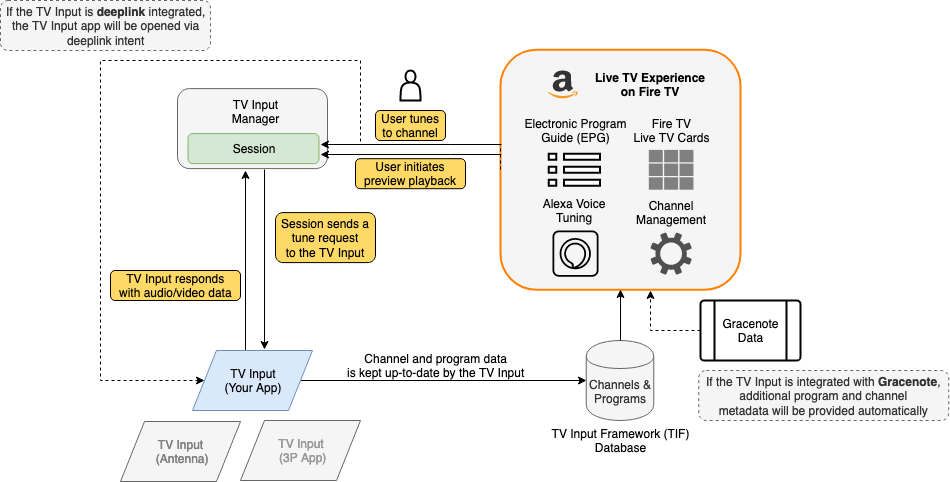

## Overview
Here you will find a sample implementation of integrating live linear content provided by your app with Amazon Fire TV. Find the full docs on Amazon's developer portal - https://developer.amazon.com/docs/fire-tv/introduction-linear-tv-integration.html.

This Sample TV App builds upon [Google's Sample TV input](https://github.com/googlesamples/androidtv-sample-inputs).

## Live TV integration on Fire-TV
If your application provides live content, you can surface it in the Fire TV's Channel Guide and the "On Now" row on Fire TV's home screen as well as make it searchable. The process for integrating live content into the Fire TV browse and search experience follows the same steps as outlined in the standard Android documentation. You need to create a TvInputService and provide channel information for Fire TV to consume. Optionally, you can implement a few shortcuts and alternative options in your app. For example, you can rely on Amazon services to surface programming metadata, and playback can be handled within your application and launched through deeplinks instead of being embedded within the Live TV player native to all Fire TV devices.

## Fire TV supports the following Live TV features:
- Linear channel tiles appear in Fire TV home and live tab for customers entitled to your content
- Channels appear in Fire TV's channel guide with 14 days of programming
- Playback integrated in Fire TV UI
- Channel tiles can deeplink directly into your app
- Search for station and programming information for next 14 days
- Alexa support for utterances such as "Tune to [channel_name]" and "Tune to channel [channel_number]"
- Ability to favorite channels from browse and search experiences
- Option to provide deep link to playback

**Note:** to see these features in action, clone this repository then build with Android Studio and install the app on your Fire TV device.

## Implementation Flow

## Quick Links
- [RichTvInputService](AndroidTvSampleInput/app/src/main/java/com/example/android/sampletvinput/rich/RichTvInputService.java) - Implementation of Android TV TvInputService. Handles live preview playback on the Fire TV Surface, parental controls (PCON), and track notifications.
- [SampleChannelManager](AndroidTvSampleInput/app/src/main/java/com/example/android/sampletvinput/SampleChannelManager.java) - Channel and program sync logic. Performs diff-based updates using `ContentProviderOperation` batch, persists the channel ID routing map to SharedPreferences, and inserts a 24-hour rolling program schedule.
- [ChannelSyncWorker](AndroidTvSampleInput/app/src/main/java/com/example/android/sampletvinput/ChannelSyncWorker.java) - WorkManager periodic background sync (24-hour interval).
- [InitializationReceiver](AndroidTvSampleInput/app/src/main/java/com/example/android/sampletvinput/InitializationReceiver.java) - BroadcastReceiver for `INITIALIZE_PROGRAMS`. Triggers channel sync after app install without requiring the user to open the app.
- [RichBootReceiver](AndroidTvSampleInput/app/src/main/java/com/example/android/sampletvinput/rich/RichBootReceiver.java) - BroadcastReceiver for `BOOT_COMPLETED` and `MY_PACKAGE_REPLACED`. Ensures channels are synced after device restart or app update.
- [RichTvInputSetupActivity](AndroidTvSampleInput/app/src/main/java/com/example/android/sampletvinput/rich/RichTvInputSetupActivity.java) - SetupActivity launched from Settings > Live TV > Sync Sources. Shows progress UI, runs sync, and auto-exits.
- [DemoPlayerActivity](AndroidTvSampleInput/app/src/main/java/com/example/android/sampletvinput/DemoPlayerActivity.java) - Handles the deeplink intent URI to support playback in-app when requested by the user from the Fire TV UI.
- [RichFeedUtil](AndroidTvSampleInput/app/src/main/java/com/example/android/sampletvinput/rich/RichFeedUtil.java) - Parses the bundled sample XMLTV feed, standing in for the catalog or EPG data a real app would fetch from its data source.
- [MainActivity](AndroidTvSampleInput/app/src/main/java/com/example/android/sampletvinput/MainActivity.java) - Launcher entry point. Shows the Amazon Live TV developer documentation page when the app is launched.

## Fire TV Metadata Fields
### Channel Fields currently supported by Fire TV
These are the fields supported by Fire TV UI for channel metadata.
- `displayName` - The display name for the channel
- `displayNumber` - Optional field to display a number for the channel. This field supports the Alexa tune to channel number feature
- `inputId` - The Input ID of your TvInputService
- `browsable` - Boolean value to determine if the channel should be browseable
-  `searchable` - Boolean value to determine if the channel should appear in search results
- `internalProviderData` - This field supports a JSON blob with specific keys used by Fire TV
    - `playbackDeepLinkUri` - Field to support a URI to invoke when a customer selects the channel from Fire TV's UI
    - `externalIdType` - Specifies the external metadata service type to provide channel and program metadata through Fire TV services. Talk to your Amazon contact to learn more
    - `externalIdValue` - The ID value for the external metadata provider

### Program Fields currently supported by Fire TV
These are the fields currently supported in the Fire TV UI for Program objects if you are not using any external metadata source.
- `title` - the title for the program
- `startTimeUtcMillis` - the start time of the program, in format of millisecond in UTC time
- `endTimeUtcMillis` - the end time of the program, in format of millisecond in UTC time
- `contentRating` - the standard tv content rating. Ex: TV-PG
- `episodeTitle` - the title of the specific episode of the playing program
- `shortDescription` - the short description of the program
- `longDescription` - the long description of the program. If this field is provided, it will override the "shortDescription" above.
- `thumbnailUri` - Small image for the program
- `posterArtUri` - Poster art image for the program

### Note on Program and Channel Models

Android provides program and channel model helpers in `androidx.tvprovider:tvprovider` (e.g., `Channel.Builder`, `Program.Builder`). This sample uses direct `ContentValues` with `TvContract` columns instead, but you may use the AndroidX helpers if preferred.

## Questions, Support, and Feedback
If you have further questions, support or feedback needs please reach out to your Amazon contact who will be able to further assist you. If you have general feedback for the code examples here, feel free to raise a GitHub issue in this repository.

## License
License under the Apache 2.0 license. See the LICENSE file for details.

## Version
Version 1.0

## Notice
Images/videos used in this sample are courtesy of the Blender
Foundation, shared under copyright or Creative Commons license.

- Elephant's Dream: (c) copyright 2006, Blender Foundation / Netherlands Media Art Institute / www.elephantsdream.org
- Sintel: (c) copyright Blender Foundation | www.sintel.org
- Tears of Steel: (CC) Blender Foundation | mango.blender.org
- Big Buck Bunny: (c) copyright 2008, Blender Foundation / www.bigbuckbunny.org
